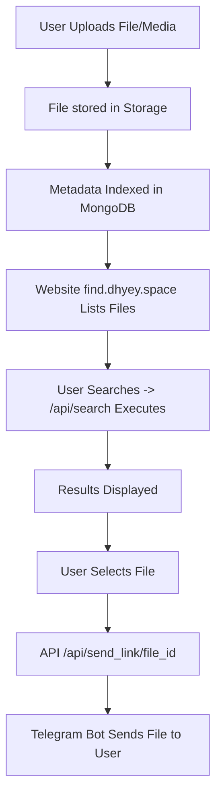

# 📘 find.dhyey.space — Search API Documentation

This document explains how to use the public Search API of **find.dhyey.space**, including all supported query parameters, usage examples, and how the Telegram file delivery API works.

---

## ✨ Features

- **Instant Search**: Results appear as you type with efficient debounce.
- **Smart Suggestions**: Auto-complete and fuzzy matching for typos.
- **Recent History**: Quickly access your last 5 searches.
- **Dynamic Stats**: Search placeholder shows live total file count (e.g., "Search 500,000+ files").
- **Keyboard Shortcuts**: Press `/` to focus the search bar instantly.
- **Copy Link**: Quickly copy the Telegram deep link to your clipboard.
- **Zero-State Tips**: Helpful suggestions when no results are found.
- **Glassmorphism Design**: Sleek, semi-transparent panels with blur effects.
- **Dynamic Themes**: Choose from Violet, Emerald, Amber, Rose, or Sky themes.

---

## 🔍 Base Search Endpoint

```
https://find.dhyey.space/api/search
```

This endpoint returns indexed files stored in MongoDB based on search filters.

---

# 📥 How to Use the API

You pass search parameters like this:

```
https://find.dhyey.space/api/search?q=QUERY
```

### 🔹 If the search term contains spaces  
Use URL encoding:

| Search Term | Encoded URL |
|-------------|-------------|
| Deforestation     | `Deforestation` |
| Cartesian Curve    | `Cartestian%20curve` OR `Cartestian+curve` |

Example:

```
https://find.dhyey.space/api/search?q=cisc%20risc
```

---

# ⚙️ Query Parameters Supported

Below is the complete list of parameters supported by your Search API.

---

## 1️⃣ `q` — Search Query (string)

Case-insensitive search on the configured `SEARCH_FIELD_NAME`.

**Examples:**

```
https://find.dhyey.space/api/search?q=engineering
```

With space:
```
https://find.dhyey.space/api/search?q=cisc%20risc
```

---

# 📦 API Response Format (JSON)

Example response:

```json
{
  "page": 1,
  "per_page": 50,
  "items": [
    {
      "id": "67a3f9d39184bb0d1c2f1234",
      "file_name": "Example File.pdf",
      "file_size": 102400,
      "caption": "Some caption",
      "year": 2023,
      "file_type": "pdf"
    }
  ]
}
```

---

# 🤖 File Delivery API

You can deliver any indexed file through your Telegram bot using:

```
https://find.dhyey.space/api/send_link/<file_id>
```

### Example

```
https://find.dhyey.space/api/send_link/67a3f9d39184bb0d1c2f1234
```

### Response

```json
{
  "link": "https://t.me/dhyeyautofilterbot?start=file_1123135015_67a3f9d39184bb0d1c2f1234"
}
```

Opening that link in Telegram sends the file to the user.

---

# � Internal Process Flow

Below is the process of how files flow through your system:



---

## 🛠️ Installation & Setup (For Developers)

1.  **Clone the Repository**:
    ```bash
    git clone https://github.com/dhyeyppatel/File-Finder-Web.git
    cd File-Finder-Web
    ```

2.  **Install Dependencies**:
    ```bash
    pip install -r requirements.txt
    ```

3.  **Configure Environment**:
    Create a `.env` file:
    ```env
    MONGO_URI=mongodb+srv://...
    DB_NAME=your_db
    COLLECTION_NAME=your_collection
    SEARCH_FIELD_NAME=file_name
    ```

4.  **Run the App**:
    ```bash
    python app.py
    ```
